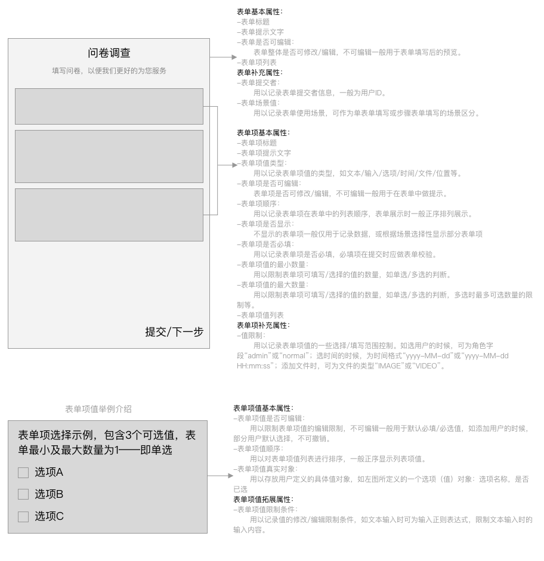

# 表单组件说明文档

当前版本 `lib-version`
 
[](https://www.jitpack.io/#hslooooooool/qsos-form)

引用:

```groovy
dependencies {
        // 基础版本，自行实现时选择
        implementation 'com.github.hslooooooool.qsos-form:form-lib:[lib-version]'
        // 普通版本，简单表单时可选
        implementation 'com.github.hslooooooool.qsos-form:form-normal:[lib-version]'
}
```

## 设计图


## 技术
- Kotlin
- AndroidX
- LiveData

## 前言
在我们开展的各种业务中，表单的填写和提交都是非常常见的场景之一。

为整合相同功能性需求，我开发了此款表单组件。

这是第三版，前面两版的设计较为复杂，且或多或少加入了一些具体业务的实现，所以不符合一个通用的表单的设计。
因此我减少了之前表单的一些功能和具体实现，只提炼核心的设计部分，以少量的代码规范后续的开发思路。
具体各项表单项的实现交还给开发人员，更匹配的实现需求。

同时也开发了普通的表单项交互案例，没有特殊业务需要可使用普通的版本。针对有定制业务的可进行拓展后使用，见后话。

## 核心设计
### 核心实体的设计
核心实体包含：表单实体/表单项实体/表单项值实体。难点在于属性值的确定，属性多了冗余，少了怕不够。
确定的实体及其属性如下：

- 表单
    - 表单标题
    - 表单提示文字
    - 表单是否可编辑
        表单整体是否可修改/编辑，不可编辑一般用于表单填写后的预览。
    - 表单项列表
    - 表单提交者
        用以记录表单提交者信息，一般为用户ID。
    - 表单场景值
        用以记录表单使用场景，可作为单表单填写或步骤表单填写的场景区分。

- 表单项
    - 表单项标题
    - 表单项提示文字
    - 表单项值类型
	    用以记录表单项值的类型，如文本/输入/选项/时间/文件/位置等。
    - 表单项是否可编辑
	    表单项是否可修改/编辑，不可编辑一般用于在表单中做提示。
    - 表单项顺序
	    用以记录表单项在表单中的列表顺序，表单展示时一般正序排列展示。
    - 表单项是否显示
	    不显示的表单项一般仅用于记录数据，或根据场景选择性显示部分表单项
    - 表单项是否必填
	    用以记录表单项是否必填，必填项在提交时应做表单校验。
    - 表单项值的最小数量
	    用以限制表单项可填写/选择的值的数量，如单选/多选的判断。
    - 表单项值的最大数量
	    用以限制表单项可填写/选择的值的数量，如单选/多选的判断，多选时最多可选数量的限制等。
    - 表单项值列表
    - 表单项值限制
        用以记录表单项值的一些选择/填写范围控制。如选用户的时候，可为角色字段“admin”或“normal”；选时间的时候，为时间格式“yyyy-MM-dd”或“yyyy-MM-dd HH:mm:ss”；添加文件时，可为文件的类型“IMAGE”或“VIDEO”。

- 表单项值
    - 表单项值是否可编辑
        用以限制表单项值的编辑限制，不可编辑一般用于默认必填/必选值，如添加用户的时候，部分用户默认选择，不可撤销。
    - 表单项值顺序
	    用以对表单项值列表进行排序，一般正序显示列表项值。
    - 表单项值真实对象
	    用以存放用户定义的具体值对象，如左图所定义的一个选项（值）对象：选项名称，是否已选
    - 表单项值限制条件
	    用以记录值的修改/编辑限制条件，如文本输入时可为输入正则表达式，限制文本输入时的输入内容。

## 拓展设计
"表单项真实值"是自行拓展的关键。

自行设计相应的表单项值真实实体对象（需继承 `AbsValue` ），通过范型将真实对象与对应的表单项样式绑定起来，并通过实现 `FormConfig`，将值类型
和表单项视图进行绑定即可。

大致步骤如下：

- 定义真实值对象

表单项值的真实属性在这里进行定义。

```kotlin

package vip.qsos.form_n.model

import vip.qsos.form_lib.model.AbsValue

/**
 * @author : 华清松
 * 表单项值-文本实体类
 * @param content 输入内容
 */
data class FormValueOfText(
        var content: String? = ""
) : AbsValue()
```

- 定义列表项视图

对表单项的具体操作在这里自行实现。

```kotlin

package vip.qsos.form_n.hodler

class FormItemTextHolder(itemView: View) : BaseFormHolder<FormItemEntity<FormValueOfText>, FormValueOfText>(itemView) {

    override fun setData(position: Int, data: FormItemEntity<FormValueOfText>) {
        data.formValue?.value?.let {
            itemView.item_form_text.text = it.content
        }
    }
}
```

- 定义列表与视图关联

```kotlin

package vip.qsos.form

import vip.qsos.form_lib.config.FormConfig

class FormConfigImpl : FormConfig {

    override fun getViewType(valueType: Int): Int {
        return valueType
    }

    override fun getValueType(viewType: Int): Int {
        return viewType
    }

    override fun getHolder(parent: ViewGroup, viewType: Int): BaseFormHolder<*, *> {
        val layoutId = getLayoutId(getValueType(viewType))
        val view = LayoutInflater.from(parent.context).inflate(layoutId, parent, false)
        return when (viewType) {
            0 -> FormItemTextHolder(view)
            1 -> FormItemInputHolder(view)
            else -> FormItemTextHolder(view)
        }
    }

    /** valueType = FormItemEntity.valueType */
    override fun getLayoutId(valueType: Int): Int {
        return when (getViewType(valueType)) {
            0 -> R.layout.form_item_text
            1 -> R.layout.form_item_input
            else -> R.layout.form_item_text
        }
    }

}
```

## 后话
以此为基础，设计并搭建相关领域的各类表单项集合，此后可根据业务领域和需要选取符合其需要的表单项集合进行使用。